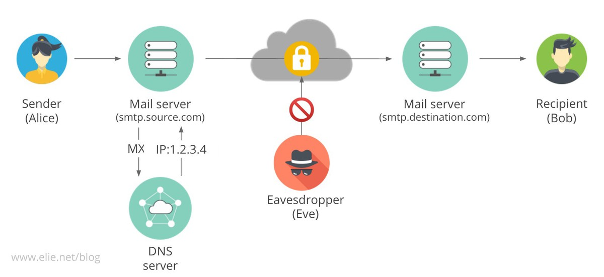

% Sicherer Nachrichtenversand in der MPG
% Paul Menzel (Max-Planck-Institut für molekulare Genetik)
% 8. November 2018

## Wer bin ich?

{ height=25% }\


- Systemarchitekt beim [Max-Planck-Institut für molekulare Genetik](https://www.molgen.mpg.de/)
- Diplom-Wirtschaftsmathematiker ([TU Berlin](https://www.tu-berlin.de/))
- FLOSS-Befürworter

## Präsentation

Folien in Markdown mit [Pandoc](https://pandoc.org/) nach LaTeX-Beamer umgewandelt, verfügbar auf GitHub.

TinyURL: <https://tinyurl.com/smtpinitiative>

<https://github.com/paulmenzel/initiative_sicherer_nachrichtenversand_in_der_mpg>

# Problemstellung

## Ziel

-  Sichere Übertragung von Daten innerhalb der MPG
-  Geheim und authentifiziert
-  Ausweitung auf alle Universitäten und Forschungseinrichtungen

### Betrachtung in Vortrag

-  SMTP: Zwischen SMTP-Servern (MTA)

## Angriffsmodell

-  Annahme: Keine Übernahme der Server durch Angreifer
-  Annahme (SMTP): Vertrauen in Betreiber der Server auf Sender- und (Ziel-)Empfängerseite
-  Mittelsmannangriff

## Mittelsmannangriff

{ height=50% }

## Realistisch?

-  Innerhalb der MPG: DFN-Netz separat vom „Internet“
-  Dienste außerhalb

```
$ host -t mx maxplanckflorida.org
maxplanckflorida.org mail is handled by \
0 maxplanckflorida-org.mail.protection.outlook.com.
$ host -t mx cbs.mpg.de
cbs.mpg.de mail is handled by \
10 mx0-cbs-mpg.heinlein-support.de.
cbs.mpg.de mail is handled by 20 \
mx1-cbs-mpg.heinlein-support.de.
```

-  Netzwerkgeräte meist im Ausland produziert und enthalten Blobs
-  Snowden-Veröffentlichungen zeigen, dass realistisch

## Lösungen (TLS)

-  SMTP: `STARTTLS`

-  Zertifizierungsstellen (DFN, [Let’s Encrypt](https://letsencrypt.org/))
-  [Monkeysphere Project](http://web.monkeysphere.info/)
-  DNSSEC/DANE

### Nur bei SMTP

-  Ende-zu-Ende-Verschlüsselung (PGP/GPG, S/MIME)

## Zielumsetzung

### SMTP

-  Authentifizierung: Zustellung an korrekten Server
-  Schutz der Metadaten
-  Geheime Übertragung auch bei nicht Ende-zu-Ende-Verschlüsselung

# Angriffe

## Poodle, DROWN, …

Verschiedene Angriffe.

1.  Downgrade-Attacke (STARTTLS)
2.  Poodle, DROWN
3.  Unsichere Chiffren

## Sichere Konfiguration

<postmaster@….mpg.de> nach RFC 822 Pflicht!

1.  [BetterCrypto.org](https://bettercrypto.org/)
1.  [Mozilla Wiki: Security/Server Side TLS](https://wiki.mozilla.org/Security/Server_Side_TLS)
1.  [Cipherli.st](https://cipherli.st/)

## Test

### WWW

1.  [Hardenize](https://www.hardenize.com/)
1.  [SSL-Tools](https://ssl-tools.net/)
1.  [SSL Server Test von Qualys SSL Labs](https://www.ssllabs.com/ssltest/analyze.html?d=login.rz.ruhr-uni-bochum.de)

### Kommandozeile

1.  OpenSSL, GnuTLS
1.  [Nmap](https://nmap.org/)
1.  [SSLyze](https://nabla-c0d3.github.io/)
1.  SMTP: `posttls-finger`

# SMTP

## Ideal für SMTP

Mehrere Komponenten: DNS, Zertifikate

### TLS

-   MX-Eintrag stimmt mit Servernamen überein

### DNSSEC/DANE

-  TLSA-DNS-Einträge

## Beispiel zu posttls-finger

    $ /usr/sbin/posttls-finger -c -l secure \
    -P /etc/ssl/certs mpifr-bonn.mpg.de
    posttls-finger: mail2.mpifr-bonn.mpg.de[134.104.18.60]:25: \
    Matched subjectAltName: mail2.mpifr-bonn.mpg.de
    posttls-finger: mail2.mpifr-bonn.mpg.de[134.104.18.60]:25 \
    CommonName mail2.mpifr-bonn.mpg.de
    posttls-finger: mail2.mpifr-bonn.mpg.de[134.104.18.60]:25: \
    subject_CN=mail2.mpifr-bonn.mpg.de, issuer_CN=MPG CA, \
    fingerprint=CA:5D:E7:7C:8A:6B:C5:4B:CC:7E:DB:F1:0C:43:C1:76:48:15:8C:38, \
    pkey_fingerprint=FD:27:CA:F2:DD:0B:AD:91:9C:6E:83:90:5E:A4:D7:DF:1A:50:BB:F5
    posttls-finger: Verified TLS connection established to \
    mail2.mpifr-bonn.mpg.de[134.104.18.60]:25: \
    TLSv1.2 with cipher \
    ECDHE-RSA-AES256-GCM-SHA384 \(256/256 bits)

## Probleme bei Nutzung von DFN-Mailsupport

1.  DFN kein DNSSEC
1.  Seit zwei Jahren
1.  Aktueller Stand: Einführung im 1.\ Halbjahr 2019

## Postfix-Konfiguration

1.  Client:

        $ postconf smtp_tls_security_level
        smtp_tls_security_level = dane

1.  Zitat von <http://www.postfix.org/TLS_README.html#client_tls_dane>:

    > The "dane" level is a stronger form of opportunistic TLS that is
    > resistant to man in the middle and downgrade attacks when the
    > destination domain uses DNSSEC to publish DANE TLSA records for its MX
    > hosts. If a remote SMTP server has "usable" (see section 3 of RFC 7672)
    > DANE TLSA records, the server connection will be authenticated. When
    > DANE authentication fails, there is no fallback to unauthenticated or
    > plaintext delivery.
    >
    > If TLSA records are published for a given remote SMTP server (implying
    > TLS support), but are all "unusable" due to unsupported parameters or
    > malformed data, the Postfix SMTP client will use mandatory
    > unauthenticated TLS. Otherwise, when no TLSA records are published, the
    > Postfix SMTP client behavior is the same as with may.

# Initiative

## Geschichte

1.  Initiative von Jan Behrendt zur verplichtenden Nutzung von DNSSEC und TLS
    1.  <https://wiki.init.mpg.de/share/DNSSEC>
    1.  <https://wiki.init.mpg.de/share/TLS>
    1.  <https://wiki.init.mpg.de/share/BPG/MailService>
1.  Sonderpreis 2015: <https://wiki.init.mpg.de/share/Communication/ITCommunityAward/2015>

## Aktueller Stand

1.  Postfix: `/etc/postfix/tls_policy` mit `mpg.de encrypt` und `*.mpg.de encrypt`
1.  DNSSEC wenig verbreitet
1.  DANE noch weniger
1.  MTA-STS noch in Kinderschuhen
    1.  Nachteil: Erste Verbindung ungesichert
1.  Eigene Lösung

##  Textdatei mit Domains mit korrektem Zertifikat

1.  Ähnlich HTTPS-Everywhere
1.  Git-Depot: <https://gitlab.com/dpkg/tls-policy>
1.  Zusammenführungsanfragen (Merge-Requests)
1.  Für alle MTA-Betreiber (insbesondere Unis)

## Beispiel Postfix

Aktuell:

    $ postconf smtp_tls_policy_maps
    smtp_tls_policy_maps = hash:/project/mx/etc/tls_policy

Änderung:

    $ postconf smtp_tls_policy_maps
    smtp_tls_policy_maps = btree:/etc/postfix/tls_policy_extern
                           btree:/etc/postfix/tls_policy_fraunhofer
                           btree:/etc/postfix/tls_policy_helmholtz
                           btree:/etc/postfix/tls_policy_leibniz
                           btree:/etc/postfix/tls_policy_mpg

## `smtp_tls_policy_maps`

<http://www.postfix.org/postconf.5.html#smtp_tls_policy_maps>:

> Specify zero or more "type:name" lookup tables, separated by whitespace or
> comma. Tables will be searched in the specified order until a match is found. 

1.  cron-job oder abonnieren der Änderungen

## Fazit

1.  MPG-Netz auch Vorbildwirkung
1.  Mehr Gewissenhaftigkeit
1.  Mehr Bewusstsein (DNSSEC, DFN)
1.  Ohne DANE keine automatische Konfiguration möglich, manuelle Konfiguration erforderlich
1.  Unerstützung von MTA-STS
1.  Überprüfung von MTA-Servern
1.  Ende-zu-Ende-Verschlüsselung

# Fragen
